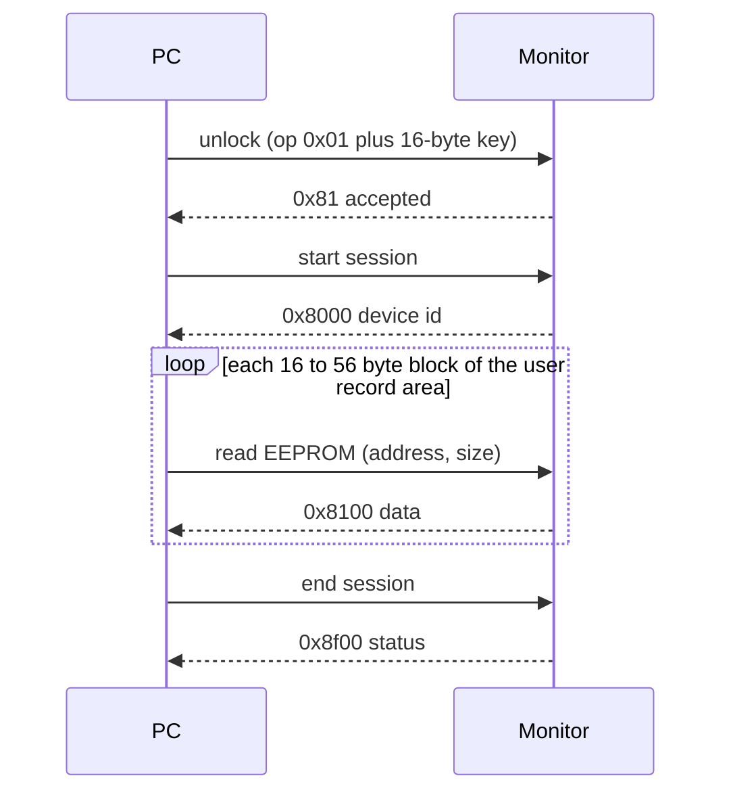

# OmronBP

[![Release][release-badge]][release-latest] [![License: MIT][license-badge]](LICENSE)

[release-badge]: https://img.shields.io/github/v/release/Flinterpop/OmronBP
[release-latest]: https://github.com/Flinterpop/OmronBP/releases/latest
[license-badge]: https://img.shields.io/badge/license-MIT-green

*Last updated: 18 Sep 2026*

Version 0.1.1

Downloads stored readings from OMRON Bluetooth LE blood-pressure monitors directly to a CSV file, without the OMRON app. Runs on Windows 10/11 using the built-in Bluetooth stack.

## Supported monitors

| Retail name | Internal model | Users x readings |
|---|---|---|
| BP7000 (Evolv) | HEM-7600T | 1 x 100 |
| BP7450 / BP7455CAN (10 Series) | HEM-7342T | 2 x 100 |

Notes:

- The BP7455CAN is the Canadian variant of the BP7450 and shares its memory layout (verified against hardware, Sep 2026).
- Layouts are plain data (`DeviceLayout` in `omron_bp/models.py`), so adding another model is a matter of transcribing its addresses and bit positions.
- `python -m omron_bp models` lists the names the tool accepts.

## Windows app (no Python needed)

`win32/` holds a native Windows version of the same tool: a single portable `OmronBP.exe` (about 650 KB, no installer, no runtime DLLs) with a point-and-click UI. It uses the same `readings.csv` and `devices.json`, kept next to the exe, so the Python tool and the app can be used interchangeably on the same data.

- **Read all monitors** — press the Bluetooth button on each monitor, click once; new readings are appended and the chart, table and per-monitor summary refresh. Bond swapping between monitors happens automatically.
- **Pair new monitor...** — opens a dialog that lists OMRON monitors live as they advertise; put the monitor in pairing mode, pick it, choose its model and a nickname.
- **Chart** — systolic/diastolic with 140/90 reference lines, pulse below, hover for exact values, 30/90-day, 12-month and all-time ranges. Lines break across gaps longer than 30 days.
- **Keep monitor clocks on PC time** (on by default) — every read compares the monitor's clock with the PC's and corrects it when it is more than 30 s off. See *Clock sync* below.
- **Show Bluetooth details** — prints every packet in the log pane; useful if something fails.
- **Export...** — writes a new CSV covering the last 30 / 60 / 90 / 180 days, 12 months, or everything, for the selected monitor or all of them; the dialog previews how many readings match. By default it also writes a **PDF report** next to the CSV (same name, `.pdf`): a summary box (count, averages, ranges, how many readings were at or above 140/90, flagged irregular heartbeats) followed by the full table, paginated with page numbers. The PDF is what to hand to a doctor; the CSV opens in Excel. Both are generated by the app itself with no external libraries.

Build (Visual Studio 2026, CMake):

```powershell
cd win32
cmake -S . -B build -A x64
cmake --build build --config Release
build\Release\core_tests.exe      # protocol, decoder, storage, PDF and clock-sync tests: 93 checks
```

The exe is `win32/build/Release/OmronBP.exe`; copy it anywhere. It is written in C++20 against the raw Win32 API, with C++/WinRT for Bluetooth LE and Direct2D for the chart; the protocol, record decoding and storage code mirrors the Python modules one-to-one and is covered by `win32/tests/core_tests.cpp`.

## Setup (Python tool)

```powershell
pip install bleak
```

Everything runs from the project directory with `python -m omron_bp ...`.

## First time: pair each monitor

The monitor only talks to a PC that has stored a pairing key in it. Pairing is done once per monitor.

1. On the monitor, hold the Bluetooth button until the display shows a **blinking P**.
2. Run:

```powershell
python -m omron_bp pair evolv --model BP7000
python -m omron_bp pair ten   --model BP7455CAN
```

`evolv` and `ten` are nicknames of your choosing; they are saved with the model and Bluetooth address in `devices.json`. If more than one monitor is in pairing mode at once, pass `--address` with the one you want (see `scan`).

Pairing bonds the monitor to Windows silently (no dialog). The Evolv may show *Pair this device* in words instead of a `P` the first time after a battery change; either is pairing mode. The Evolv's pairing window is short and it advertises only intermittently, so run the command the moment the display shows it.

**One bond at a time.** Every OMRON monitor hands Windows the same Bluetooth identity key, and Windows refuses to bond a second device with a key it already holds (System log, BTHUSB event 35: *"trying to distribute an Identity Resolving Key that is already used by a paired device"*). Every readout needs the bond, so the tool releases the other registered monitors' bonds and re-bonds the one it is about to read. Monitors accept this in normal mode, so it just adds a second or two when switching between them.

## Every time: download readings

1. Press the monitor's Bluetooth button so the Bluetooth symbol shows (it advertises for about a minute).
2. Run:

```powershell
python -m omron_bp read
```

That tries every monitor in `devices.json` and appends new readings to `readings.csv`. Give a nickname to read just one, e.g. `python -m omron_bp read evolv`.

Then `python -m omron_bp chart --open` rebuilds the chart page from the CSV and opens it in your browser.

The tool reads every stored record on each run and skips any already in the CSV (same monitor, user, timestamp and values), so it is safe to run repeatedly. The only thing it ever writes to a monitor is its clock, and only as described under *Clock sync*.

## Clock sync

Both monitors turned out to keep poor time: the 10 Series was 58 minutes slow (never moved for daylight-saving time) and the Evolv's clock had stopped outright after a battery change, so every new measurement was being stamped with the same stale time. Because readings are only as useful as their timestamps, every read now checks the monitor's clock and, by default, corrects it:

1. After the readings are downloaded, the settings record that holds the clock is read and its checksum verified. A matching checksum proves the record layout is right for this monitor; without it nothing is ever written.
2. The monitor time is compared with the PC's local time. Within 30 s it is reported as OK.
3. Beyond 30 s, if the layout verified and sync is enabled, the PC time is written back into the same record (only the six date/time bytes and the checksum change; the rest is copied as read). The monitor applies it when the session ends, so the following read confirms it.

Disable it with the checkbox in the app or `read --no-clock-sync` on the command line; drift is still reported. The clock layouts come from the omblepy project and were verified on both monitors here (the record checksums matched and the corrections took).

## Output

`readings.csv` columns:

| Column | Meaning |
|---|---|
| `timestamp` | Local date/time from the monitor's clock, `YYYY-MM-DD HH:MM:SS` |
| `model` | Internal model, e.g. `HEM-7600T` |
| `device` | Nickname given at pairing |
| `user` | User slot on the monitor (1 or 2) |
| `systolic`, `diastolic` | mmHg |
| `pulse` | beats per minute |
| `movement` | 1 if the monitor flagged body movement |
| `irregular_heartbeat` | 1 if the monitor flagged an irregular heartbeat |

## Troubleshooting

- **`scan` never shows the monitor, and everything it does show is at -85 dBm or weaker.** The PC's Bluetooth receiver is deaf, not the monitor. On a desktop with onboard Intel Wi-Fi/Bluetooth (e.g. an ASUS board with an AX210), Bluetooth shares the two RP-SMA antenna jacks on the rear I/O panel; screw the supplied antenna on. With the antenna attached the monitor shows at around -70 dBm from across a room. Bluetooth 1.x/2.x adapters (old printer or camera dongles) cannot see the monitor at all; BLE needs Bluetooth 4.0 or later.
- **`Device ... was not found`.** The monitor only advertises for about a minute after its Bluetooth button is pressed, and goes back to sleep straight after any session. Press the button again and re-run.
- **`Operation aborted` right after connecting.** The monitor occasionally drops a fresh connection; `read` retries three times on its own. If it keeps happening, press START/STOP on the monitor, then the Bluetooth button, and try again.
- **Monitor shows `Err`.** A transfer was cut off before the end-of-session command (e.g. the program was killed mid-read). Press START/STOP to clear it. Nothing is lost.
- **Bonding fails with `Could not pair with device: FAILED`, and Windows Settings says *Try connecting your device again*.** Another OMRON monitor is bonded to this PC (see *One bond at a time* above). The tool handles this for registered monitors; for one it does not know about, remove the other monitor in *Settings > Bluetooth and other devices* first.
- **Several readings share exactly the same timestamp.** The monitor's clock was stopped when they were taken (the Evolv does this after a battery change). The readings are real and are all kept; clock sync fixes the cause on the next read.
- **Pairing reports `could not enter key-programming mode`.** The monitor was not in pairing mode (solid Bluetooth symbol is normal mode; you need the blinking `P`), or it timed out of pairing mode before the connection was made. Re-enter pairing mode and run again promptly.

## Other commands

| Command | Purpose |
|---|---|
| `read [NAME ...] [--no-clock-sync]` | Download readings; `--no-clock-sync` reports clock drift without correcting it |
| `scan [--timeout S] [--all]` | List monitors currently advertising (`--all` shows every BLE device) |
| `export [--days N] [--device NAME] [--out FILE] [--pdf]` | Write a time-bounded copy of the readings (last N days, one or all monitors) to a new CSV; `--pdf` also writes the doctor-ready PDF report next to it |
| `chart [--open]` | Render `readings.csv` as `readings.html`: interactive systolic/diastolic and pulse charts per monitor, with time-range presets and a table view. Self-contained (no internet needed), so it can be emailed or opened anywhere |
| `models` | List supported model names |
| `--debug` (before the subcommand) | Log every Bluetooth packet |
| `--key HEX` | Use a different 16-byte pairing key |

The default pairing key is the one used by the open-source `omblepy` and UBPM projects, so a monitor paired here also works with those tools.

## How it works



Commands are XOR-checksummed packets split into 16-byte chunks across four write characteristics; replies come back the same way on four notify characteristics and are reassembled in `omron_bp/transport.py`. Readings are fixed-size records (14 or 16 bytes) with bit-packed fields, decoded in `omron_bp/models.py`.

## Development

```powershell
python -m pytest                     # 62 tests
python -m ruff check .
python -m mypy omron_bp tests
```

The protocol framing, record and clock decoders, storage and PDF writer are unit-tested without hardware in both languages. Code follows the Power of 10 conventions used across these projects (bounded loops, assertions, short functions, `mypy --strict`, `/W4 /WX`).

## Project layout

| Path | What |
|---|---|
| `omron_bp/` | Python package: `transport` (BLE framing), `models` (record and clock layouts), `bond` (Windows bond juggling), `reader`, `storage`, `chart`, `pdf`, `cli` |
| `tests/` | pytest suite |
| `win32/src/` | C++ app: `protocol`, `models`, `storage`, `pdf`, `report` (core, mirrors the Python modules), `ble` (C++/WinRT), `workflow`, `chart` (Direct2D), `main`, dialogs |
| `win32/tests/` | `core_tests.exe` |
| `release.ps1` | Version lockstep check, both test suites, static build, dependency check, artifact zip |

## Releasing

The version lives in `pyproject.toml`, `omron_bp/__init__.py`, `win32/CMakeLists.txt`, `win32/src/app.rc` (numeric tuple and string), `win32/src/app.manifest` and the *Version* line at the top of this file; `release.ps1` refuses to build unless they all agree. It then runs the Python checks and tests, builds the C++ app and tests in Release with the static CRT, confirms the exe imports no VC++ runtime DLL and reports the right file version, and writes `dist/OmronBP-v<version>-win64.zip` containing the exe and this README. Tagging is done by hand (`git tag -a v<version>`). Readings, the device registry and any exports are git-ignored: they are personal health data and never belong in the repository.

## License

MIT - see [LICENSE](LICENSE). The wire protocol and per-model memory layouts were learned from the open-source [omblepy](https://github.com/userx14/omblepy) and [UBPM](https://codeberg.org/LazyT/ubpm) projects; this is an independent implementation that stays compatible with their pairing key. OMRON is a trademark of OMRON Healthcare; this project is not affiliated with or endorsed by them.

## Release notes

### v0.1.1 — 18 Sep 2026

Application icon (title bar, taskbar, Explorer). No functional change.

### v0.1.0 — 18 Sep 2026

First release. Python CLI and native Win32 app for the OMRON BP7000 (Evolv, HEM-7600T) and BP7450/BP7455CAN (10 Series, HEM-7342T): pairing, readout with automatic Windows bond swapping, CSV storage, interactive charts (HTML from the CLI, Direct2D in the app), time-bounded CSV export with a doctor-ready PDF report, and monitor clock verification and sync.
